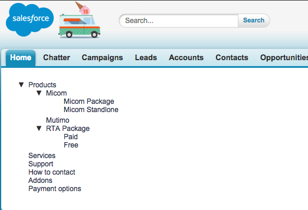
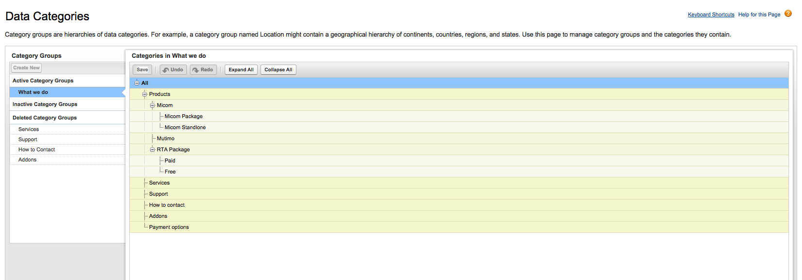

# Data-Categories-in-tree-structure-like-Saleforce
Displaying data categories in tree structure on VF page like Salesforce does on Standard page. This is accomplished with help of a library 'jqtree'.

